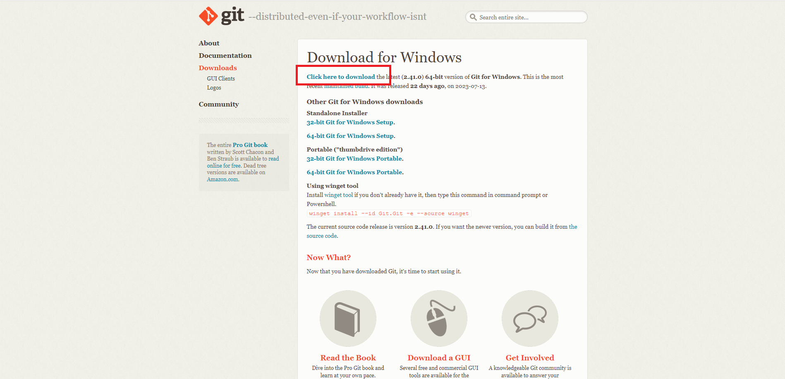
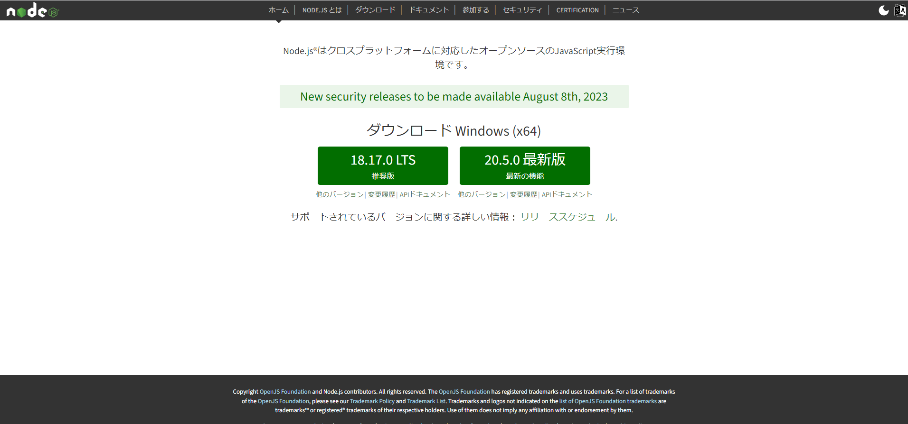

# machikane23
2023年度まちかね祭のホームページのレポジトリです。

# 初期設定（windows）
## gitのインストール
簡単に言うとファイルを他の人と共有するのに必要なソフト  
特に仕組みを知らなくても大丈夫だけど、知りたければ[この辺](https://backlog.com/ja/git-tutorial/intro/01/)から

1. [https://git-scm.com/download/win](https://git-scm.com/download/win)にアクセスして、*Click here to download* のリンクをクリックしてダウンロード。

2. ダウンロードしたexeファイルを開いてインストールを進める。特にこだわりがなければ右下ボタン連打でOK
3. 終わったところで、コマンドプロンプトを開いて以下のコマンドを入力
```
git --version
```
こんな感じでなんかそれっぽいのが出れば成功(数字はタイミングよってまちまち)
```
C:\Users\xxxx>git --version
git version 2.34.1.windows.1
```

## npmのインストール
node package manager の略　先人たちが作ってくれた偉大なライブラリの数々をタダで利用できる
。  
1.  [https://nodejs.org/ja](https://nodejs.org/ja)にアクセスしてそれっぽいボタンからダウンロード  
推奨版（左）をダウンロードするのが無難


2. ダウンロードしたexeファイルを開いてインストールを進める。特にこだわりがなければ右下ボタン連打でOK
3. 終わったところで、コマンドプロンプトを開いて以下のコマンドを入力
```
npm --version
```
こんな感じでなんかそれっぽいのが出れば成功(数字はタイミングよってまちまち)
```
C:\Users\xxxx>npm --version
npm WARN config global `--global`, `--local` are deprecated. Use `--location=global` instead.
8.11.0
```

## レポジトリのクローン
クラウドに上がってるソースコードを自分のパソコンにダウンロードする作業  

1. コマンドプロンプト上で以下のコマンドを実行
```
cd 自分の作業したいフォルダ
git clone https://github.com/tyuujitu/machikane23.git
cd machikane23

```

2. 関連パッケージのダウンロード
```
npm install
```
最後がこんな感じのログになれば成功
```
.....
added 1500 packages, and audited 1501 packages in 16s

240 packages are looking for funding
  run `npm fund` for details

6 high severity vulnerabilities

To address all issues (including breaking changes), run:
  npm audit fix --force

Run `npm audit` for details.

```
3. branchを切る  
詳しい説明は適当に調べるか先輩に聞くか...

(さっきの続きから)
```
git checkout -b dev
```
もしくは
```
git checkout dev
```


# 作業を始める前に
1. VS Codeで作業フォルダを開く
2. VS Code上でCtrl+Shift+C　（コマンドプロンプトが開く）
3. 最新の状況にアップデート
```
git pull origin dev
```  
（これをしないと他の人と「conflict」と呼ばれるめんどくさい状況になりかねない）  

4. 開発サーバー起動
```
npn run start
```
勝手にブラウザが開くはず。

5. VS Code上で好きに編集する

# 作業が終わった後
1. コマンドプロンプト上でCtrl+Cを押してサーバーを止める
2. 今日書いたソースコードをアップロード
```
git add .
git commit -m "なんか好きなメッセージ"
git push origin dev
```


# トラブルシューティング
### エラーが出た / 出力がなんか怪しい / よくわかんない
出力（エラーログ）をコピペして先輩に送り付けましょう

